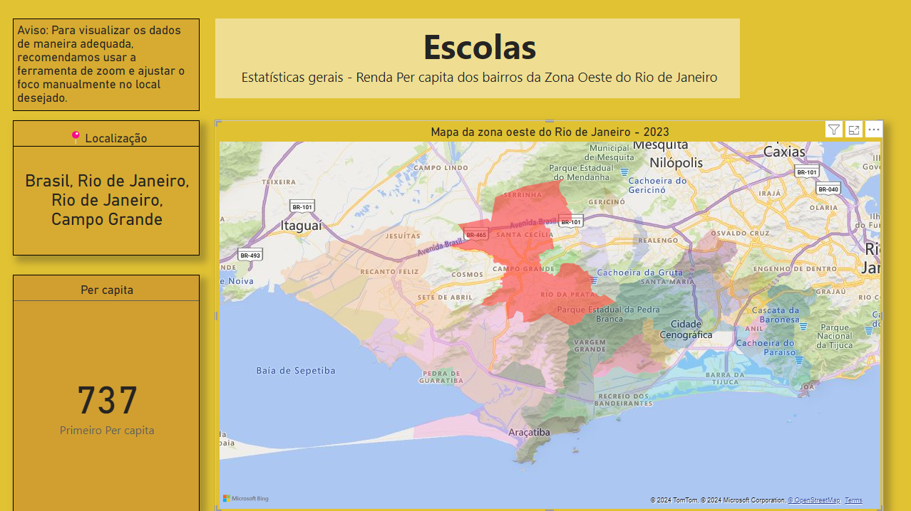

# Dashboard-MatriculasEscolares

Este projeto foi o meu extensionista da faculdade, aonde pude utilizar Power BI para análise de dados, permitindo a visualização de informações detalhadas em um mapa interativo. O objetivo principal é facilitar a exploração de grandes volumes de dados geográficos, permitindo o usuário entender melhor os padrões e insights.

_Mapa de renda per capita da cidade do Rio de Janeiro_